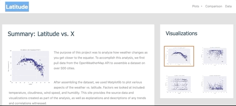

# Web Visualization Dashboard

The project is focused on creating a static website with weather data. The website have the following characteristics:

* Individual pages for each plot and a means by which we can navigate between them
* The pages contain the visualizations and their corresponding explanations.
* Landing page, a page where we can see a comparison of all of the plots
* Another page where we can view the data used to build them.

## Features 

* Use of Bootstrap, HTML, and CSS
* Website adjusted to any screen
* Analysis for each plot

## Built with 

* Bootstrap
* HTML
* CSS

## Outcomes

Functionality of the website

